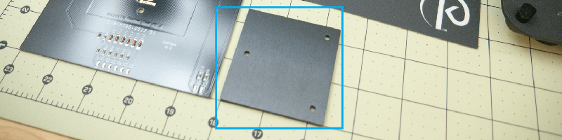
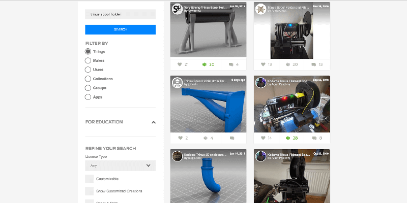
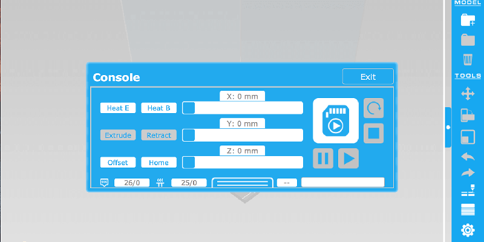
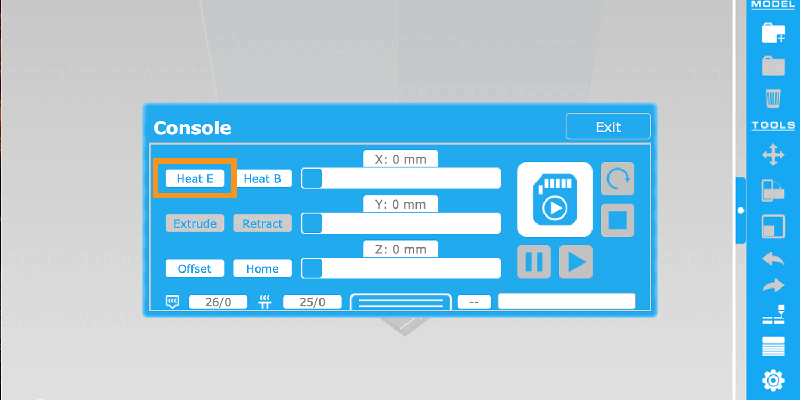

## Pre-Check

### Heated Build Plate

Please ensure you installed the small black spacer under the bed first. See how it’s installed in the official video:

[https://vimeo.com/album/4289066/video/195241496

](https://vimeo.com/album/4289066/video/195241496) 

You will also **need** to install the BuildTak material on top of the Heated Bed. You can’t print directly on the surface of this bed, since it’s too slick anything to stick. Plus there is a good chance of ruining your brand new heated bed if you tried.

> ##### Tip: Installation Tweak ([Forum Thread](http://www.kodamaforums.com/phpBB3/viewtopic.php?f=22&t=1467))
> You want to make sure you install a zip tie around the cable connection and through the holes at the back left of the heated build plate. This is to help reduce any fatigue caused by the constant motion.
> 
>  

>  
>  *Idea provided by Roi Igarashi @ Kodama*
>  

> 
> ##### WARNING {.warning}
> The downside to having a secured cable (above image), is that the zip ties rounded bump will crash into the small fan shroud at the bottom of the Extruder Assembly. So you will need to stay away from this little corner when slicing models. If you come up with a better working solution to keep the cable secure, please leave feedback on Facebook or the Forums.

<!-- -->

> ##### Tip: Secure cable to the Z-Axis
> it’s also a good idea to secure the end of the pigtail loop to the Z-axis slider.
> 
> 

> 
> *Idea and image provided by Rick Miller*
> 

<!-- -->

> ##### Tip: Part Removal
> One of the community members (sorry, can’t remember who told me about it) had posted about how they like to heat up the build plate to about 60C to help with the removal of the printed models. 
>
> Using one of the recommend [removal tools](#extra-useful-tools) you should slowly work your way under an edge of the printed object, then move the tool around the entire underside of the model until it’s fully released. This will help ensure your BuildTak material lasts a good long time. 
>
> ##### WARNING {.warning}
> Please **DO NOT** try and rip the model from the BuildTak, this is how you destroy the surface and it ends up being very expensive to keep replacing them. This also ensures you don’t prematurely destroy your heated bed in the process.

<!-- -->

> ##### Tip: Cleaning
> Heat build plate to 100C to soften any residue that might have been left behind after removing your printed models, so it will be easy to clean up with your [removal tool](#extra-useful-tools) of choice. 
>
> Here’s a video showing how to clean the BuildTak material with 70% Alcohol as well: <https://www.youtube.com/watch?v=BrJc2cqYeXI>

### Normal Bed
This is installed on its own, **don’t use** the small black spacer from the [Heated Bed](#heated-build-plate).

### Spool Holder
OMG where is my Spool Holder? Well, this is meant to be one of your first functional prints. You have the option to grab the official spool holders or one of the community created options. While printing these, you can simply stand your spool up behind the printer, then check on it during printing to ensure it doesn’t get tangled up on anything.

**Official Spool Holders (see [Downloads](#download-it) section)**

*Normal Spool Holder (left) and Enclosure Spool Holder (right)*

**Community Created Spool Holders**  
[http://www.thingiverse.com/search?q=trinus+spool+holder 

](http://www.thingiverse.com/search?q=trinus+spool+holder)

### Pango
Get the latest version (2.3+) as it will be needed to get you set up.

#### Download It
**Facebook Group - Files Section**  
<https://www.facebook.com/groups/Trinus3D/files/>

**Forum Post - Facebook File Sync**  
Since as of this writing the [Forum Downloads](http://www.kodamaforums.com/phpBB3/page/downloads) section doesn’t have the same files as the Facebook Group (this may change when things settle down on Kodama’s side), but for now these files have been downloaded and tossed into a DropBox share; latest additions will be posted here:  
<http://www.kodamaforums.com/phpBB3/viewtopic.php?f=21&t=363>

#### Install It
**Windows**  
You can run Pango from any directory. Just open the “pango.exe” file.

**Mac**  
Move Pango application from your Downloads folder to your Application folder. This is due to the security restrictions that OSX applies to the Downloads folder.

#### Setup USB Connection
It’s very important to get your USB connection setup now, else you may go mad trying to get your printer running at peak performance.

**Mac USB Connection**  
<http://www.kodamaforums.com/phpBB3/viewtopic.php?f=8&t=370>

**Windows USB Connection**  
<http://www.kodamaforums.com/phpBB3/viewtopic.php?f=22&t=304>

**Test USB Connection**  
If for some reason you can’t complete these steps, please post details about your system in the forum threads above, so that the community members can help you out.

* Connect the Power and USB Cables to your Trinus.
* Once fully powered up, connect the USB Cable to your computer.
* Open Pango, and click on View -> Console 
* Select the USB connection from the Port list. 
* Now click on the Console button in this window, to view the Printer Controls. 
* Now click on the “Heat E” button to heat up the Extruder. The LED on the Trinus should change to Red if all goes well. Click the “Heat E” button again to stop the process. 
* USB Test Successful.

> ##### Tip: Mac just won’t connect for me (advanced option)
> If you happen to have a copy of Windows 7+ lying around, then you can install a copy of windows into a “virtual machine” using free software like VirtualBox (<https://www.virtualbox.org>).

### Extra “Useful” Tools
The Trinus contains with the basics when it comes to tools you may need. But here are a few other items that will make your life easier when starting out.

#### Pliers
If you EVER plan on changing your Nozzle (getting different sizes or extra 0.4 nozzles) you will want these to hold the nozzle when it’s hot. Plus these are great for grabbing the support material / rafts and ripping them away from your model.

#### Wire Cutters
I find these are great to have around for cutting a 45deg angle in the filament before trying to load some up, cutting bad sections of filament off, and even making a clean cut at the end of zip ties

**Recommendation**  
Flush Cutters - [US](http://amzn.to/2jVOVSx) / [UK](https://www.amazon.co.uk/dp/B0052RPBY6) (love these things)

#### Hobby Spatula / Paint Scraper
This will help a TON when trying to remove the prints from the build plate. Things have a tendency to stick pretty darn good to the BuildTak material provided. You can even get some thin metal Paint Scrapers from your local hardware store.

**Recommendations**  
Hobby Spatulas - [US](http://amzn.to/2kmnePr) / [UK](https://www.amazon.co.uk/dp/B006YR55ZS/)  
Japanese Spatula - [US](http://amzn.to/2jkeoEk) / [UK](https://www.amazon.co.uk/dp/B001ILG3SI/)

#### Precision Screwdriver Set
This will come in handy whenever you need to break down your Extruder Assembly. Due to the fact the assembly contains 1.5mm grub screws. 

**Recommendation**  
45 Piece Screwdriver Set - [US](http://amzn.to/2kEQphG) / [UK](https://www.amazon.co.uk/dp/B01KTSU340)

#### SD Card Reader
If your computer doesn’t already have one, get one, all you’ll do is drive yourself CRAZY if you don’t have one of these. 90% of all 3D printers use SD Cards, so if you ever plan on expanding your printer collection, get one… just GET ONE.

> ##### Tip: You might have one
> Most Laptops have these built-in as well, so please check if you already have one.

#### M3/M4 Screws/Nuts
Get a variety pack of these screws and nuts, especially if you’re in the US, since it can be a PAIN to find the right length that you need. Also get some **M3 x 25mm and M3 x 30mm** screws, the 25mm length ones are what’s currently used for the Axis Offset Screws, but if you wanna play around with using a Glass Bed, you will need longer screws (hence the 30mm ones).
