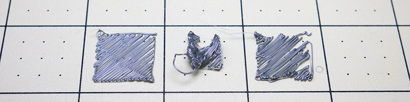
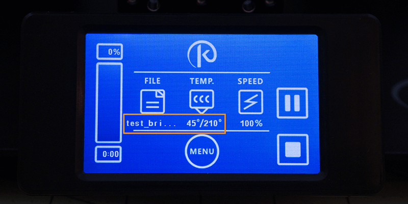
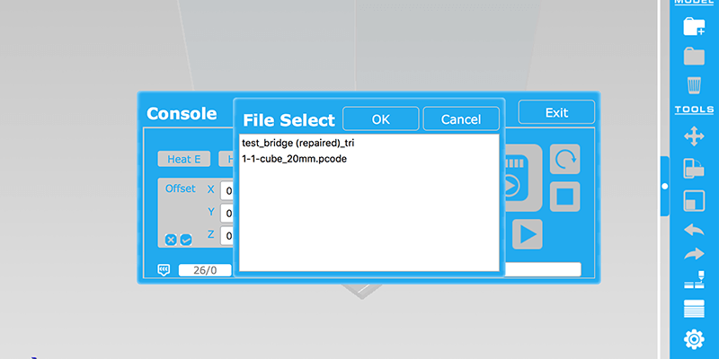

## First Print

Some of the SD Cards that came with the Trinus were blank. But you can get all the files that were meant to be included on the card online, see the [Download](#download-it) section above, as these files are stored alongside Pango.

Before loading up your SD card with any files, it’s recommended to reformat it using FAT32 file system. Users have experienced random stops when using bad SD cards, which seem to be corrupting the files stored on them; formatting the card can help prevent this. If you’re not sure how to format an SD card, google is your friend: [Windows](https://www.google.com/webhp?sourceid=chrome-instant&ion=1&espv=2&ie=UTF-8#q=How%20to%20format%20sd%20card%20windows) | [Mac](https://www.google.com/webhp?sourceid=chrome-instant&ion=1&espv=2&ie=UTF-8#q=How%20to%20format%20sd%20card%20mac)

> ##### Tip: What do all those beeps and LED colors mean?
> Here’s a forum post describing what the various colors and sounds mean:
<http://www.kodamaforums.com/phpBB3/viewtopic.php?f=22&t=1440>

<!-- -->

> ##### Tip: Formatting didn’t help
> You might have a bad SD Card. If you have another SD Card available that is 32GB or smaller, try that one and see if that fixes your printing problem.

### Loading Filament
I think for this one, it’s better explained in a video format. So here’s a detailed video on loading filament into the Trinus. A [quick tip version](https://youtu.be/7yxVfIXOCTI) is also available on the same YouTube channel, if you just want the 1min quick and dirty walkthrough.

**Breakdown: Trinus - Loading Filament**  
[https://youtu.be/oYl3rGYUAbo

](https://youtu.be/oYl3rGYUAbo)

> ##### Tip: Filament Guide (advanced upgrade, not required)
> Here’s a filament guide widget that will help you with loading filament, of course you need to at least load it once without this guide, so that you can print the model. The creator of this model recommends using PETG filament; so your mileage may vary using less heat resistive materials such as PLA. If you're completely new to 3D Printing this might be a daunting mod, since you need to dismantle your Extruder Assembly in order to install this.
<http://www.thingiverse.com/thing:2041586>

### Download Pre-configured Test File
From the [Download](#download-it) section, we’ll start by grabbing the **Pokemon Autoprint** test file.

### Start Printing

#### Autoprint File on SD

* Unzip the contents of the file so that you can see the file named "**autoprint.pcode**"
* Copy the **“autoprint.pcode”** file to the root of your SD Card.
* Remove the SD Card from your computer after the file completes writing.
* Now place the SD Card into your printer and push down until it clicks into place. This should cause the Printer to beep twice, telling you it found the "autoprint.pcode" file and it's starting the print.
* After the printing process begins, the extruder needs to heat up to temperature before it starts, you want to pay attention to the first couple layers of filament.
* If the first couple layers aren't sticking to the bed, like the extruder is just dragging them around, you need to eject to the SD card so that the printer stops right away. You want the first layer to have a flat top, but not so flat that you can can see the build plate underneath it (unless you are using transparent filaments, then that’s a different story).
* Here’s an example of a good first layer 
* Here’s a couple examples of bad first layers. The ones on the left and right had barely enough sticking power to keep it from sticking to the nozzle, but the one in the center wasn’t so lucky. This is why you want to ensure the nozzle is exactly the right distance from the build plate. If you run into these type of issues you may need to go back to the [Set Nozzle Distance](#set-nozzle-distance) section and adjust some more. 

#### Using LCD
If you have the LCD add-on, then you can name the file anything you want when you place it on the SD Card. Simply choose the file from the LCD UI and it will start the printing process.

* Click the File icon on the main screen. 
* Choose the file you want to print. 
* Then you can see a partial name of the file you selected, the temperature set for the initial layers, as well as Pause and Stop buttons. The bar on the left side of the LCD will show a progress bar (fills up from bottom to top), percentage complete (top), and the current time elapsed (bottom). 

> ##### Tip: No Folders or Special Characters
> Right now the LCD screen won’t let you navigate through folders on the SD Card, so you will need to store all your pcde/gcode files, that you want to print, on the root of the card. Users have also noticed that the file names can only contain AlphaNumeric, Spaces, and Dashes in their names, otherwise it can cause the LCD to just send you back to the main menu without starting the print.

#### Pango Console
If you don’t want to use the “autoprint.pcode” naming convention, for automatic prints, you can simple name the files whatever you want, then print them via the Pango Console.

* Connect to the Pango Console (see [USB Setup](#setup-usb-connection) instructions).
* Now you can simply click on the SD Card icon. 
* Choose the file you want to print. 
* Then after choosing the file, Pango will automatically close the console and start the printing process (might be a bug, not sure). So if you want to see what’s happening, you will need to re-open the console. At the start of the print you will just notice the Temperature set for the initial layers and the Heated Bed Temperature (bottom left of console). 

### Troubleshooting Print Issues
I would definitely recommend these troubleshooting guides that Simplify 3D and the folks in the Ultimaker Community put together, lots of great information on solving common print issues.

**Simplify 3D Troubleshooting Guide**  
<https://www.simplify3d.com/support/print-quality-troubleshooting/>

**Ultimaker Troubleshooting Guide**  
<http://support.3dverkstan.se/article/23-a-visual-ultimaker-troubleshooting-guide>
