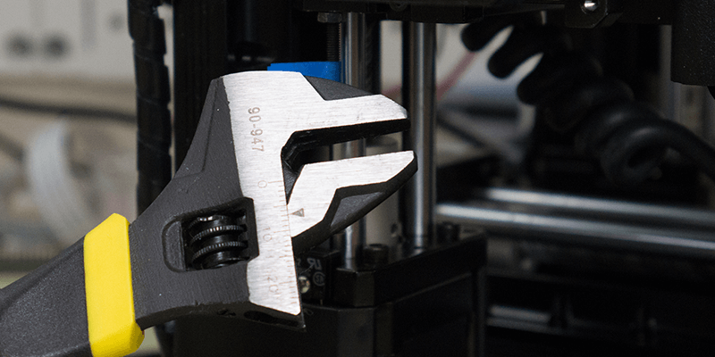

### Maximize Build Volume - 3D Printing
Here’s the process to get the maximum use of the build volume, by getting your nozzles “Home” position to be exactly at the front left corner of your build plate.

#### Helpful Print
The following little helper tool will let you easily hand tighten / loosen the offset screw locking nuts. BUT you will first need to use a wrench to loosen them initially, since they were tighten quite a bit during assembly. There are 2 versions of this helper, one of them has a section cut out (right image) that lets you slide the tool over the screw shaft for usage.

**Trinus - Axis Adjustment Helper** <br/> 
[http://www.thingiverse.com/thing:2041158

](http://www.thingiverse.com/thing:2041158)

#### Adjust the Offset Screws
Now let’s begin the meticulous process of adjusting the offset screws to maximize the build volume.

> ##### WARNING {.warning}
> Just like when you had went through the process to [Set Nozzle Distance](#set-nozzle-distance), you will want to do this with a cold nozzle.

* Loosen all the locking nuts with a wrench.  Ideally you'll use a 5.5mm open-ended or combination wrench, as it allows you to work within the enclosure.  I didn’t have one small enough to fit so I just used an adjustable wrench for this. 
* The locking nut on the Y axis (slider holding your bed) is a tough nut to reach. If you don’t want to remove the bed itself, then you can simply unscrew the slider to give you more room to loosen the nut, and install the helper tool. 
* Now that we have things all prepped, it’s time to start tweaking the offset screws. 
* For this part I found that loosening the locking nut (via the helper tool), then adjusting the screws about 2 turns.
 * From the factory you will most likely need to **screw** in the Y axis offset and **unscrew** the X axis.
* Each time you move the screw (in or out)  you will want to Home the axis to check how things look. This is how you want the X / Y distance to look from the corners. 
* Then you need to move the slider to its max position (X = 120, Y = 125) to ensure it’s not going to hit the end of the slider before reaching the max value. This is very important for the Y axis as the nozzle needs to be right at the edge (image above) otherwise it will crash into the front of the slider.
* With your nozzle just above each corner you should now be able to use the entire build volume.

> ##### WARNING {.warning}
> Before trying to move any axis to its max position you need to Home that axis. The Trinus doesn’t know the position of the axis until it’s been homed. So when you change the offset screws, it no longer knows it’s “correct” position, so you need to Home the axis to reset what the “0” position is.

<!-- -->

> ##### Tip: Z-Offset Via 3rd Party Slicer (advanced user)
> If you prefer to use a 3rd Party Slicer for “everything”, then there is a way to set / get the current Z-Offset value via the Terminal window in your prefered slicer. The Terminal window is just a way to send individual Gcode commands to the printer. Here are the 2 commands, first one to get the current value and the second will set the value (positive = closer to bed, negative = further away). These are **case sensitive**, so a lowercase "m" will not work.
> 
> ```
> M628 ; Get Current Z-Offset Value
> M628 Z0.08 ; Set Current Z-Offset Value to 0.08mm
> ```
